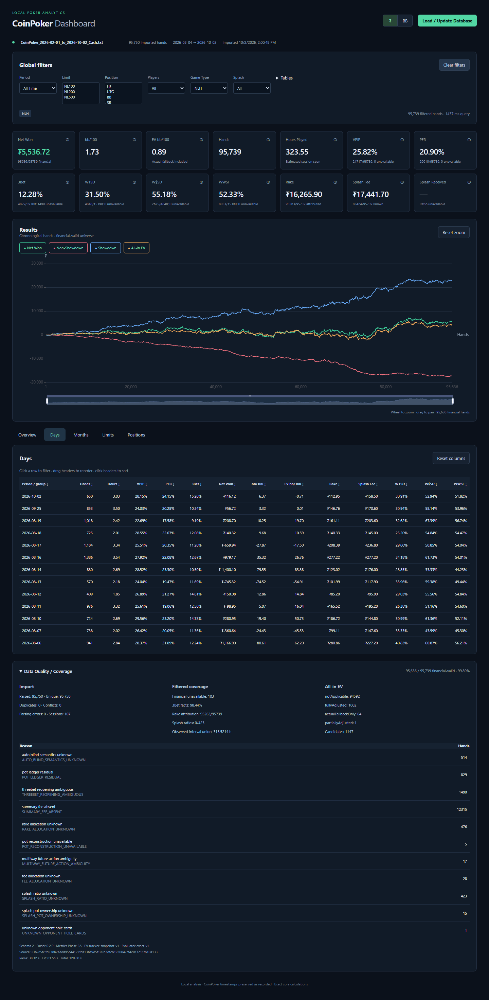
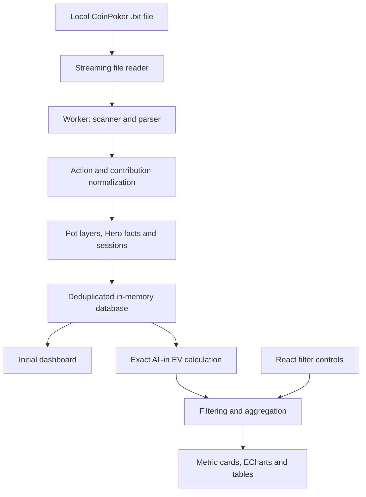

# CoinPoker Dashboard

A local-first poker analytics dashboard for CoinPoker hand histories. Import a `.txt` export to explore your results, All-in EV, playing statistics, and breakdowns by day, month, stakes, and position.

**[Open the dashboard](https://rostickkin.github.io/coinpoker-dashboard/)**

Your hand history is processed on your device and never uploaded. No account, backend, or server database is required.



## Features

- File picker and drag-and-drop import with progress tracking and cancellation.
- Net Won, bb/100, EV bb/100, hand count, and estimated playing hours.
- VPIP, PFR, 3Bet, WTSD, W$SD, WWSF, rake attribution, and Splash Fee, including Rake bb/100 and Splash Fee bb/100 in all tables.
- Interactive Net Won, Showdown, Non-Showdown, and All-in EV chart with zoom, pan, and line toggles.
- Global filters for dates, stakes, position, player count, game type, tables, and Splash category.
- Days, Months, Limits, and Positions tables with sorting, draggable columns, and row-to-filter navigation.
- Currency (`₮`) and big-blind (`BB`) display modes.
- Data Quality / Coverage panel showing duplicates, conflicts, parsing errors, EV coverage, and unavailable facts.

## Getting started

1. Open the website and click **Load / Update Database**, or drop a CoinPoker `.txt` export onto the page.
2. Wait for parsing to finish. Basic results become available while All-in EV is still being calculated.
3. Apply filters; use Ctrl/Cmd-click to select multiple stakes or positions.
4. Explore the chart and tables. Clicking a table row applies the corresponding global filter.
5. Expand **Data Quality / Coverage** to inspect calculation coverage and exclusion reasons.

The default game filter is **NLH**. Select **Game Type → All** to include BombPot hands. **Clear filters** restores the default NLH selection.

Hand data lives in the tab's memory: reload the page and select your file again. Only interface preferences are saved in `localStorage`. Cancelling a replacement import preserves the previous completed database.

## Architecture

The application uses **React 19**, **TypeScript**, **Apache ECharts**, and **Vite**. A **Web Worker** handles parsing, normalization, equity calculations, filtering, and aggregation separately from the interface thread. The production build is a static website.



| Directory | Responsibility |
| --- | --- |
| `src/ui/` | React interface, chart, tables, filters, and Worker orchestration |
| `src/parser/` | Streaming line/hand scanners and CoinPoker parser |
| `src/normalize/` | Action normalization and contribution ledger |
| `src/pots/` | Main-pot and side-pot reconstruction |
| `src/metrics/` | Hero facts, statistics, aggregation, and session estimation |
| `src/equity/` | Hand evaluator, exhaustive board enumeration, and All-in EV |
| `src/special/` | Splash rules and separate promotion accounting |
| `src/import/` | Import pipeline, canonicalization, deduplication, and conflicts |
| `src/core/` | Integer money and rational arithmetic |
| `tests/` | Calculation, scenario, aggregation, and browser tests |
| `scripts/` | Optional local validation and research reports |

## How calculations work

The Worker reads the file in chunks, computes its SHA-256 fingerprint, and splits it into hands. Parsing preserves actions and diagnostics; normalization reconstructs monetary contributions. Duplicate hands are skipped, while conflicting versions of the same hand ID are counted without overwriting the accepted version. Pot layers, Hero facts, and sessions are then built, and hands are ordered by their recorded timestamps.

Core monetary values use integer cents (`BigInt`); EV uses rational numbers. Currency-to-BB conversion is performed per hand using that hand's own big blind. Percentages retain their numerator, eligible denominator, and exclusion counts. Unavailable facts remain explicitly unavailable instead of becoming zero.

Rake bb/100 and Splash Fee bb/100 are 100 times the sum of Hero's attributed charge divided by each hand's own BB, divided by the number of hands with available attribution and a positive BB. Known zero charges count; unavailable charges are excluded.

All-in EV exhaustively enumerates legal board completions with exact hand evaluation. It does not use Monte Carlo or assumed opponent ranges. When an adjustment cannot be reconstructed reliably, the primary EV result retains the actual outcome for that part of the hand and records the reason. Consequently, the EV line can include actual-result fallback.

Net Won represents Hero's poker cash flows and excludes separately received Splash rewards. Sessions split at gaps greater than 30 minutes; hours are estimated session spans. Timestamps preserve the calendar values written in the export.

See [CORE_METHODS.md](CORE_METHODS.md) for detailed calculation policies.

## Limitations

- Designed for CoinPoker text exports; other rooms' formats are not supported.
- Exact EV requires sufficient card, contribution, and commission-allocation information. Ambiguous hands may be partially adjusted or use actual fallback.
- BombPot preflop statistics, positions, and simultaneous-board EV are unsupported.
- **Splash Received** uses an estimated average 50:50 distribution: half of the cash drop goes to the pot, half is shared equally among players marked as dealt in. Explicit table/date ratios can override the estimate. Known shares are summed even when some hands lack pot-winner data; the card labels the number of incomplete hands. `—` means no share can be calculated; no Splash events gives zero.
- Hours estimate session duration rather than precise active time. Hours grouped by stakes can overlap.
- Large imports and exhaustive equity calculations need time and device memory. A modern desktop browser is recommended.

## Local development

Requires **Node.js 24.21 or later** and npm.

```bash
npm ci
npm run dev
```

Open the local address printed by Vite.

```bash
npm run typecheck
npm test
npm run build
npm run preview
```

`dist/` contains the static application and its Worker assets. Serve it over HTTP using `npm run preview` or a static host.

## GitHub Pages deployment

[`.github/workflows/pages.yml`](.github/workflows/pages.yml) checks types, runs tests, builds the application, and deploys `dist/` whenever changes are pushed to `main`. It can also be started manually from **Actions**.

In **Settings → Pages → Source**, select **GitHub Actions**. The build sets `VITE_BASE_PATH` to `/<repository-name>/`; local development defaults to `/`. The workflow derives the repository name automatically, so asset and Worker URLs also work under a Pages project subdirectory.

Private hand histories, research exports, and local hosting metadata are excluded from Git. Public test fixtures use anonymized identifiers. The website opens with a file upload screen; the README screenshot shows an example after import.

## Optional research and browser validation

`npm run validate` and `npm run report` depend on local research files in the unpublished `analysis/` directory. Override the validator's source path with:

```bash
npm run validate -- --source="C:/path/history.txt"
```

Run `npm run test:e2e` with installed Google Chrome to check imports, filters, tables, preferences, and recovery using the anonymized fixtures. The full-dataset regression is skipped unless `COINPOKER_SOURCE` points to the original private reference export; it is not part of public CI. Core tests, type checking, and production builds do not require a personal hand history.

Browser tests start their own server on port `5175` and do not reuse an existing development server. Set `COINPOKER_TEST_PORT` to choose a different port.
